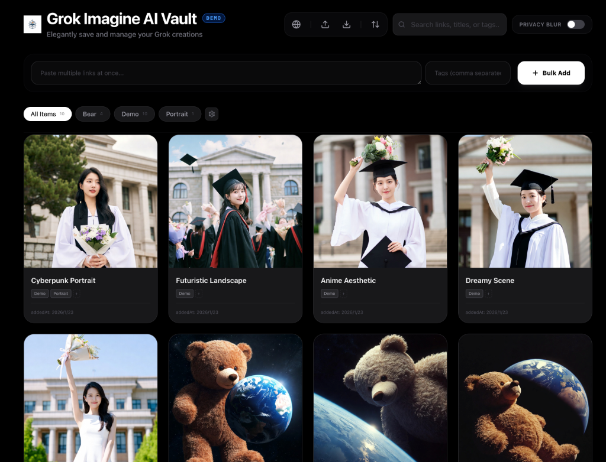

<div align="center">
  
</div>

# Grok Imagine AI Vault

**English** | [繁體中文](README_zh-TW.md) | [简体中文](README_zh-CN.md) | [日本語](README_ja.md)

An elegant management tool designed for [Grok.com](https://grok.com/imagine), allowing you to collect, categorize, and backup all your AI-generated works effortlessly.

[**🌐 Live Demo**](https://grok-imagine-ai-vault.vercel.app/) — See it in action!

---

### 🚀 Quick Start (3-Minute Setup)

1.  **Install Helper**: Load the `grok-extension` folder into Chrome Developer Mode ([Installation Guide](extension_newbie.md)).
2.  **Capture Images**: Click "COPY ALL" on the helper panel in Grok, or use `Shift + Drag` to select images.
3.  **Start Local**: Run `node server.js` and `npm run dev` ([Terminal User Guide](terminal_newbie.md)).
4.  **Paste & Save**: Press `Ctrl/Cmd + V` on the Vault web page, and you're done!

---

<div align="center">
  
</div>

## ✨ Key Features

-   **Categorized Settings Menu**: A professional sidebar-based settings UI, organizing options into **Privacy**, **Backup**, and **Network** for a cleaner experience.
-   **Smart Information Extraction**: Automatically extracts the original Grok ID from dragged images or complex pasted data. **Duplicate links are automatically filtered** to keep your library clean.
-   **Automatic Local Backup**: When the server is running, the system automatically downloads remote image thumbnails to your local cache, preventing link expiration.
-   **Batch Download to System**: Download all your saved creations directly to your **System Default Downloads Folder** for easy access.
-   **Privacy & Aesthetics**: Features "Privacy Blur" mode, immersive Picture-in-Picture preview, and modern UI indicators (Stars/Aperture) for a premium look and feel.
-   **Vault Helper (Extension)**: Enhances your browsing with auto-detection, range export, lasso selection, and a "Batch Like" feature to preserve link persistence.

## 💡 Pro Tip: How to keep your images forever?

> [!TIP]
> **Highly recommended**: ALWAYS **"Like" (❤️)** your favorite images on Grok.com.
> This associates the images with your account metadata, significantly reducing the risk of links becoming inaccessible. You can use the "❤️ LIKE BATCH" button in the Vault Helper to do this quickly.

## 🛠️ How to Add Items?

1.  **Bulk Paste**: Paste one or more Grok Imagine links directly into the Vault interface (separated by newline, comma, or space).
    *   Examples:
        ```text
        https://grok.com/imagine/post/e8910ae5-f4e5-42d4-ae10-b5852027ae69
        https://grok.com/imagine/post/946bef9e-8884-4960-856e-336ae977ad97
        ```
2.  **Drag & Drop**: Simply drag images from Grok.com or your local folder into the Vault; the system will automatically recognize them.
3.  **Vault Helper (Recommended)**: Install the [grok-extension](grok-extension/) for the most seamless capture experience.

<div align="center">
  
</div>

## 🚀 Getting Started

1.  **Requirement**: Ensure you have [Node.js](https://nodejs.org/) installed.
2.  **Installation**:
    ```bash
    git clone https://github.com/koehhian/Grok-Imagine-AI-Vault.git
    cd Grok-Imagine-AI-Vault
    npm install
    ```
3.  **Running**: Launch `node server.js` (Backup/Backend) and `npm run dev` (Frontend).

---

## 📸 Media Production Guide

To make your showcase posts pop, record these 4 key clips:
1.  **The Smooth Workflow**: Drag a Grok image into the Vault and show it instantly appearing.
2.  **The Lasso Drag**: Hold `Shift` and circle a group of images to show the cyan selection.
3.  **Instant Capture**: Scroll the Grok gallery and show the counter in the helper panel going up.
4.  **The Organized Vault**: A quick scroll of your finished, tagged gallery in the main web app.

---

> **Not familiar with the Terminal?** Check out the [💻 Terminal Beginner Guide](terminal_newbie.md)
> **Need help installing the extension?** Check out the [🧩 Extension Installation Guide](extension_newbie.md)

## License

This project is licensed under the **GNU GPL v3**. See [LICENSE](https://www.gnu.org/licenses/gpl-3.0.html) for details.

## Buy Me a Coffee

If you find this tool useful, feel free to buy me a coffee! ☕️
[**Buy Me a Coffee**](https://buymeacoffee.com/koehhian)
