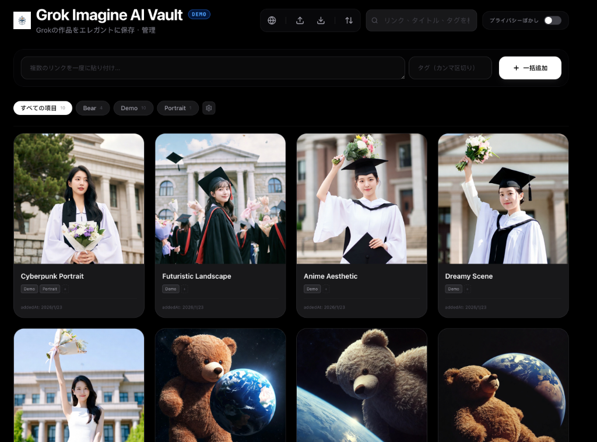
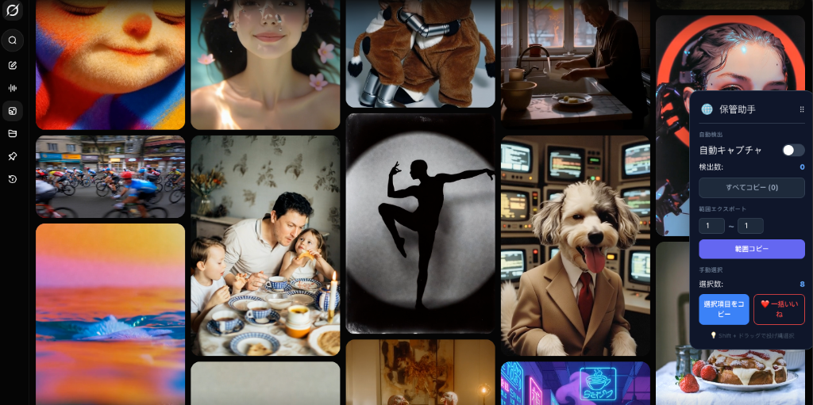

<div align="center">
  
</div>

# Grok Imagine AI Vault

[English](README.md) | [繁體中文](README_zh-TW.md) | [简体中文](README_zh-CN.md) | **日本語**

[Grok.com](https://grok.com/imagine) のために作られた、AI 生成作品をエレガントに保存・管理・バックアップするためのツールです。

---

### 🚀 クイックスタート (3分で完了)

1.  **助手をインストール**：`grok-extension` フォルダを Chrome のデベロッパーモードで読み込みます（[インストールガイド](extension_newbie_ja.md)）。
2.  **画像をキャプチャ**：Grok のページで助手パネルの「すべてコピー」をクリックするか、`Shift` を押しながらドラッグして画像を選択します。
3.  **ローカルで起動**：`node server.js` と `npm run dev` を実行します（[初心者向け起動ガイド](terminal_newbie_ja.md)）。
4.  **Vault に貼り付け**：Vault の管理画面で `Ctrl/Cmd + V` を押して貼り付ければ完了です！

---

<div align="center">
  
</div>

## ✨ 主な特徴

-   **洗練された Web 管理画面**：ダークモード、タイル表示（ウォーターフォール）で作品を美しく閲覧。複数選択、一括削除、タグ管理に対応。
-   **スマートな ID 抽出**：画像をドラッグ＆ドロップしたり、複雑なデータを貼り付けたりしても、元の Grok ID を自動的に抽出します。
-   **自動ローカルバックアップ**：サーバーを起動すると、リモートの画像を自動的にローカルの `backups/` フォルダに保存し、リンク切れを防ぎます。
-   **プライバシーと美学**：プライバシー保護のための「ぼかしモード」、没入感のある Picture-in-Picture プレビュー、強力なタグシステムを搭載。
-   **Vault 助手 (拡張機能)**：自動検出、範囲エクスポート、投げ縄選択、さらには「一括いいね」機能でリンクの生存をサポート。

## 💡 ヒント：画像を長期間保存するには？

> [!TIP]
> Grok.com でお気に入りの画像に**「いいね」(❤️)** を付けることを**強くお勧め**します。
> これにより画像がアカウント情報に関連付けられ、リンク切れのリスクを大幅に減らすことができます。Vault 助手の「❤️ 一括いいね」ボタンを使えば素早く完了できます。

## 🛠️ カードの追加方法

1.  **一括貼り付け**：管理画面の入力欄に複数のリンクを貼り付けます（改行、カンマ、スペース区切りに対応）。
    *   例：
        ```text
        https://grok.com/imagine/post/e8910ae5-f4e5-42d4-ae10-b5852027ae69
        https://grok.com/imagine/post/946bef9e-8884-4960-856e-336ae977ad97
        ```
2.  **ドラッグ＆ドロップ**：Grok のページやローカルフォルダから画像を直接ドラッグして追加できます。
3.  **Vault 助手 (推奨)**：[grok-extension](grok-extension/) をインストールして、自動キャプチャ機能を活用してください。

<div align="center">
  
</div>

---

## 📸 メディア制作ガイド (Media Production Guide)

魅力的な紹介ポストを作成するために、以下の4つのキーシーンを録画することをお勧めします。
1.  **スムーズなワークフロー**：Grok の画像を Vault にドラッグして、瞬時に表示・認識される様子を紹介します。
2.  **投げ縄選択 (Lasso)**：`Shift` を押しながら複数の画像を選択し、シアン色の選択エフェクトを見せます。
3.  **リアルタイムキャプチャ**：Grok ギャラリーをスクロールし、助手パネルのカウンターが増えていく様子を見せます。
4.  **整理された Vault**：タグ付けや分類が完了した、自分だけの美しいギャラリーをスクロールして見せます。

---

## 🚀 はじめかた

1.  **準備**：[Node.js](https://nodejs.org/) がインストールされていることを確認してください。
2.  **インストール**：
    ```bash
    git clone https://github.com/koehhian/Grok-Imagine-AI-Vault.git
    cd Grok-Imagine-AI-Vault
    npm install
    ```
3.  **起動**：`node server.js` (バックアップ用) と `npm run dev` (管理画面) を実行してください。

> **ターミナルの使い方がわからない？** [💻 初心者向けターミナルガイド](terminal_newbie_ja.md) を参照してください。
> **拡張機能の入れ方がわからない？** [🧩 拡張機能インストールガイド](extension_newbie_ja.md) を参照してください。

## ライセンス (License)

このプロジェクトは **GNU GPL v3** ライセンスで公開されています。詳細は [LICENSE](https://www.gnu.org/licenses/gpl-3.0.html) をご覧ください。

## コーヒーをおごる (Buy Me a Coffee)

このツールが役に立ったと思ったら、ぜひコーヒーをおごってください！応援よろしくお願いします。☕️
[**コーヒーをおごる**](https://buymeacoffee.com/koehhian)
