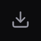

<div align="center">
  
</div>

# Grok Imagine AI Vault

[English](README.md) | **繁體中文**

<div align="center">
  
</div>

這是一個專為 Grok 設計的 AI 生成圖片管理系統，讓你能優雅、高效地整理你的創意作品。

## 功能特色

- **全方位 Grok 連結支援**: 支援捕捉 `post`、`video`、`share` 甚至 `imagine-public` 圖片直連。
- **自動縮圖與 UUID 提取**: 自動從各種 Grok 連結格式中提取 UUID 並顯示 .jpg 縮圖。
- **CDN 轉貼文功能 (CDN-to-Post)**: 直接拖入 Grok 圖片網址時，系統會自動將連結轉換為對應的 Grok 貼文網址，並保留原始圖片作為高品質縮圖。
- **強大拖拽偵測**: 智慧過濾 Base64 原始資料，優先捕捉真實網址，相容多種瀏覽器拖曳行為。
- **資料可攜性 (Data Portability)**: 輕鬆匯出與匯入完整的 JSON 資料庫，方便在不同裝置間遷移。
- **多標籤系統 (Multi-Tag System)**: 支援多標籤分類管理，並提供「更多標籤」下拉式選單。
- **Grok 風格介面**: 極簡、高對比的深色模式，搭配 **固定式頂欄 (Sticky Header)** 方便操作。
- **批次操作 (Batch Operations)**: 支援多選、批次刪除與標籤管理；批量新增支援換行、逗號或空白分隔。
- **隱私優先 (Privacy First)**: 內建一鍵模糊功能，保護瀏覽隱私。

## 使用技巧

### Grok 縮圖
為了獲得最佳體驗：
> [!IMPORTANT]
> **靜態圖片要求**: 從 Grok複製公開貼文連結時，請確保你是在查看 **靜態圖片 (Static Image)** 的狀態。如果你在圖片生成中或動態預覽時複製連結，可能會導致縮圖無法正確讀取。

### 影片手動縮圖
目前影片（包括已製作過影片的圖片連結）不支援自動縮圖，需手動加入，方法如下：
1. 點擊卡片上的圖示彈窗，開啟 Grok 頁面。
2. 在 Grok 中手動從 **影片 (Video)** 切換到 **圖片 (Image)**。
3. 將該圖片直接**拖拽**回到 Grok Imagine AI Vault 的卡片上，即可完成縮圖綁定。

### 批量上傳
您可以在批量新增欄位中貼上多個連結，支援以 **換行**、**逗號** 或 **空白** 分隔。您可以一次性為整批連結加上標籤。

### 匯出/匯入 (Export/Import)
使用頁首的 **匯出** 與 **匯入** 按鈕來備份你的資料，或將資料轉移到另一個 Vault 實例。

## 技術棧

- **Frontend**: React, TailwindCSS, Framer Motion, Lucide Icons.
- **Backend**: Node.js, Express.
- **Storage**: JSON-based flat file system (`data/links.json`).

## 快速開始

1. Clone 此專案。
2. 安裝依賴：
   ```bash
   npm install
   ```
3. 啟動應用程式：
   ```bash
   node server.js & npm run dev
   ```
4. 在瀏覽器打開 [http://localhost:5179](http://localhost:5179)。

## 授權 (License)

## 💎 進階神器：Grok Link Detector

如何有效率獲取 `grok.com/imagine` 連結：

1.  **安裝 Tampermonkey**：瀏覽器油猴插件。
2.  **建立腳本**：建立新腳本，並貼入 [`grok-detector.js`](grok-detector.js) 的內容。
3.  **自動捕捉**：在 Grok 頁面滾動，右下角會顯示捕捉數量。
4.  **同步入庫**：點擊 **"Copy for Vault"**，然後在您的 Vault 中使用「導入 (Import)」功能即可。

---
🚀 祝您的 AI 創作庫日益壯大！

本專案採用 **GNU GPL v3** 開源授權。詳情請見 [LICENSE](https://www.gnu.org/licenses/gpl-3.0.html)。

## 請我喝杯咖啡 (Buy Me a Coffee)

如果你覺得這個工具對你有幫助，歡迎請我喝杯咖啡支持開發！
[贊助連結](https://buymeacoffee.com/koehhian)
